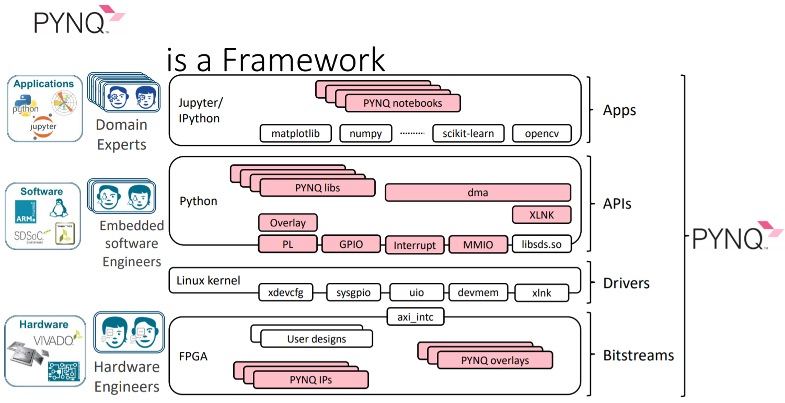

# Lab0

## Purpose

Expect every people, who join this course, can understand what is PYNQ and learn how to use PYNQ API.

## Content

### PYNQ



### Setup your hardware

Please open the [link](http://www.aiotlab.org/teaching/fpga/PYNQ%20Introduction.pdf) for more details.


## Today’s Missions

Write a toy program that:

- Lights on the LED while the corresponding button is pressed 
- And lights off the LED while the corresponding button is released 
- EX, B1 is pressed then L1 is on; B1,B3 are pressed then L1,L3 are on

```python
from pynq.overlays.base import Baseoverlay
base_overlay = BaseOverlay("base.bit")
while(True):
    for i in range(0,4,1):
        if(base_overlay.buttons[i].read()):
            base_overlay.leds[i].on()
        else:
            base_overlay.leds[i].off()
```

### Extended project

Lab 0 haven't this requirement, this program is just for fun :)

>  

```python
import numpy as np
import random
import time
score = 0
while(True):
    seed = random.randint(0,3)
    base_overlay.leds[seed].on()
    start = time.time()
    while(true):
        end = time.time()
        if(base_overlay.buttons[seed].read()):
            base_overlay.leds[seed].off()
            score += 1
            break
        elif(end - start > 1):
            base_overlay.leds[seed].off()
            break
    print(score)
```

> comment:
>
> python is fxxking weird...!
>
> rather than use python for development,
>
> I prefer to use C Language.